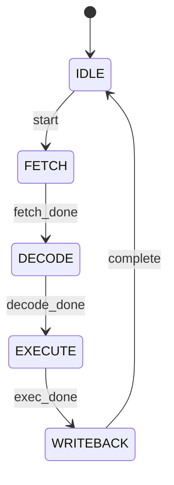

# Archive Notice (2026-04-11)

This file has been merged into README.md and is now archived.

- Canonical docs entry: README.md
- Snippet migration policy: snippets/LEGACY_POLICY.md
- This file is kept for historical traceability only.

---

# Snippets Namespace Notice (2026-04-11)

- 当前活跃 snippets 命名空间为：`sv.*`, `rtl.*`, `sva.*`, `sdc.*`, `xdc.*`, `sta.*`, `uvm.*`。
- `snippets/design` 与 `snippets/verification` 已降级为迁移参考目录；功能新增与维护仅在新目录进行。
- 如本文后续段落出现旧前缀/旧路径示例，请以 `package.json` 当前映射和 `snippets/LEGACY_POLICY.md` 为准。
# HDL Helper 详细功能说明

> **版本**: 3.0.1  
> **仓库**: https://github.com/Aligo-BTBKS/hdl-helper

---

## 目录

1. [项目概述](#项目概述)
2. [核心功能模块](#核心功能模块)
   - [多引擎语法检查](#1-多引擎语法检查-multi-engine-linter)
   - [代码生成器](#2-代码生成器-code-generators)
   - [仿真与波形](#3-仿真与波形-simulation--waveform)
   - [工程管理](#4-工程管理-project-management)
   - [语言服务](#5-语言服务-language-services)
   - [FSM可视化](#6-fsm可视化)
   - [Vivado集成](#7-vivado集成)
3. [使用指南](#使用指南)
4. [配置参考](#配置参考)
5. [测试指南](#测试指南)

---

## 项目概述

HDL Helper 是面向 FPGA/IC 工程师的 VS Code 全能 IDE 扩展，将文本编辑器升级为专业硬件开发环境。

### 核心能力

```raw
┌─────────────────────────────────────────────────────────────────┐
│                        HDL Helper                               │
├─────────────────────────────────────────────────────────────────┤
│  ┌──────────────┐  ┌──────────────┐  ┌──────────────────────┐  │
│  │ 代码生成      │  │ 多引擎检查    │  │ 仿真与波形            │  │
│  │ • AXI接口    │  │ • Verilator  │  │ • Icarus Verilog     │  │
│  │ • Memory IP  │  │ • Verible    │  │ • Surfer波形查看     │  │
│  │ • Register   │  │ • Vivado     │  │ • FST/VCD支持        │  │
│  └──────────────┘  └──────────────┘  └──────────────────────┘  │
│  ┌──────────────┐  ┌──────────────┐  ┌──────────────────────┐  │
│  │ 工程管理      │  │ 语言服务      │  │ EDA工具集成           │  │
│  │ • AST解析    │  │ • 跳转定义    │  │ • Vivado综合         │  │
│  │ • 层级视图    │  │ • 悬停提示    │  │ • Vivado实现         │  │
│  │ • IP浏览     │  │ • 符号重命名  │  │ • 报告解析           │  │
│  └──────────────┘  └──────────────┘  └──────────────────────┘  │
└─────────────────────────────────────────────────────────────────┘
```

---

## 核心功能模块

### 1. 多引擎语法检查 (Multi-Engine Linter)

#### 功能描述

HDL Helper 实现了多引擎并发检查架构，支持三种主流 Linter：

| 引擎 | 用途 | 特点 |
|------|------|------|
| **Verilator** | 硬件语义检查 | 快速捕获位宽不匹配、未驱动信号等硬件级错误 |
| **Verible** | 代码风格检查 | 行业标准风格规则，支持 LSP |
| **Vivado xvlog** | 语法检查 | Xilinx 原生支持，与 Vivado 工具链无缝集成 |

#### 架构设计

```raw
LintManager (中枢调度器)
    ├── VeribleEngine   ──→ verible-verilog-lint
    ├── VivadoEngine    ──→ xvlog
    ├── VerilatorEngine ──→ verilator --lint-only
    └── InterfaceChecker (本地检查)
```

**特性**:
- 并发执行多个引擎
- 800ms 防抖优化
- 状态栏实时反馈
- 诊断结果聚合显示

#### 使用方法

1. **配置激活引擎**

在 VS Code 设置中配置：
```json
{
  "hdl-helper.linter.activeEngines": ["verible", "verilator"]
}
```

2. **配置工具路径**

```json
{
  "hdl-helper.linter.veriblePath": "verible-verilog-lint",
  "hdl-helper.linter.verilatorPath": "verilator",
  "hdl-helper.linter.verilatorFlags": ["-Wno-WIDTH", "--bbox-sys"]
}
```

3. **自定义规则**

```json
{
  "hdl-helper.linter.rules": {
    "line-length": "length:150",
    "no-tabs": true,
    "no-trailing-spaces": true
  }
}
```

4. **查看所有规则**

执行命令 `HDL: List All Linter Rules` 查看 Verible 支持的所有规则。

---

### 2. 代码生成器 (Code Generators)

#### 2.1 AXI 接口生成器

**支持的协议**:
- AXI4-Lite (Master/Slave)
- AXI4-Full (Master/Slave)
- AXI4-Stream (Master/Slave)

**使用方法**:

1. 按 `Ctrl+Shift+P` 打开命令面板
2. 输入 `HDL: Generate AXI Interface`
3. 按向导配置参数：
   - 模块名称
   - 协议类型
   - 角色 (Master/Slave)
   - 数据宽度
   - 地址宽度
   - 是否生成 Testbench
   - 输出目录

**生成文件**:
```raw
output_dir/
├── rtl/
│   └── {module_name}.sv      # RTL 实现
├── tb/
│   └── tb_{module_name}.sv   # Testbench (可选)
└── docs/
    └── {module_name}_readme.md
```

#### 2.2 Memory IP 生成器

**支持的类型**:
- Sync FIFO (同步 FIFO)
- Async FIFO (异步 FIFO)
- Simple Dual-Port RAM
- True Dual-Port RAM

**使用方法**:

1. 执行命令 `HDL: Generate Memory IP (FIFO/RAM)`
2. 配置参数：
   - 模块名称
   - Memory 类型
   - 数据宽度
   - 深度
   - 是否生成 Testbench

**生成示例 (Sync FIFO)**:

```systemverilog
module sync_fifo #(
    parameter int DATA_WIDTH = 32,
    parameter int DEPTH = 16
)(
    input  logic clk,
    input  logic rst_n,
    input  logic wr_en,
    input  logic [DATA_WIDTH-1:0] wr_data,
    output logic full,
    input  logic rd_en,
    output logic [DATA_WIDTH-1:0] rd_data,
    output logic empty
);
    // ... 自动生成的实现
endmodule
```

#### 2.3 寄存器映射生成器

**输入格式**: CSV 或 JSON

**CSV 格式示例**:
```csv
name,offset,description
CTRL,0x00,Control Register
STATUS,0x04,Status Register
DATA,0x08,Data Register
```

**JSON 格式示例**:
```json
{
  "moduleName": "my_peripheral",
  "dataWidth": 32,
  "registers": [
    {
      "name": "CTRL",
      "offset": 0,
      "fields": [
        {"name": "ENABLE", "bitOffset": 0, "bitWidth": 1, "access": "rw"},
        {"name": "RESET", "bitOffset": 1, "bitWidth": 1, "access": "wo"}
      ]
    }
  ]
}
```

**输出文件**:
- `rtl/{name}_regs.sv` - SystemVerilog AXI-Lite Slave
- `c_header/{name}.h` - C 头文件
- `docs/{name}_regs.md` - Markdown 文档
- `docs/{name}_summary.json` - JSON 摘要

**验证功能**:
- 自动检测寄存器地址重叠
- 位域重叠检查
- 数据宽度对齐检查

#### 2.4 Testbench 生成器

**使用方法**:

1. 打开任意 Verilog/SystemVerilog 模块文件
2. 执行 `Ctrl+Alt+T` 或命令 `HDL: Generate Testbench`
3. 自动生成包含所有端口的 Testbench 模板

**生成示例**:
```systemverilog
module tb_my_module();
    // Clock & Reset
    logic clk;
    logic rst_n;

    // DUT Signals
    logic [31:0] data_in;
    logic        valid_in;
    // ...

    // DUT Instance
    my_module dut (
        .clk(clk),
        .rst_n(rst_n),
        // ...
    );

    // Clock Generation
    initial begin
        clk = 0;
        forever #5 clk = ~clk;
    end

    // Test Sequence
    initial begin
        // Add test logic here
        $finish;
    end
endmodule
```

---

### 3. 仿真与波形 (Simulation & Waveform)

#### 仿真管理

**配置文件**: `.vscode/hdl_tasks.json`

```json
{
  "tasks": [
    {
      "name": "Run Unit Test",
      "type": "hdl-sim",
      "tool": "iverilog",
      "top": "tb_top",
      "sources": ["rtl", "tb"],
      "filelist": ["sim/filelist.f"],
      "flags": ["-g2012"],
      "workingDirectory": ".",
      "buildDir": "build",
      "waveform": true,
      "waveformFormat": "fst",
      "autoOpenWaveform": true
    }
  ]
}
```
**全局仿真设置 (Workspace Settings)**:

```json
{
  "hdl-helper.simulation.tasksFile": ".vscode/hdl_tasks.json",
  "hdl-helper.simulation.iverilogPath": "iverilog",
  "hdl-helper.simulation.vvpPath": "vvp",
  "hdl-helper.simulation.buildDir": "build",
  "hdl-helper.simulation.defaultFlags": ["-g2012"],
  "hdl-helper.simulation.autoOpenWaveform": true
}
```

**支持的仿真器**:
- Icarus Verilog (iverilog) - 已实现
- Verilator / XSIM / ModelSim / QuestaSim - 规划中（当前会提示 not yet supported）

#### Module Hierarchy 集成

在 HDL Explorer 的 Module Hierarchy 视图中提供：
- `▶️ Run Simulation` - 执行仿真
- `📊 View Waveform` - 查看波形

#### 波形查看器

**支持格式**:
- FST (Fast Signal Trace) - 推荐
- VCD (Value Change Dump)

**使用方法**:
1. 在 Module Hierarchy 视图中点击 `Run Simulation` 完成仿真
2. 点击 `View Waveform`（视图标题按钮或模块行按钮）查看波形
3. 或执行命令 `HDL: View Waveform` 并选择波形文件

---

### 4. 工程管理 (Project Management)

#### 模块层级视图

在侧边栏 HDL Explorer 中显示：
- 模块实例化层级树
- 设置 Top Module
- 快速导航

**操作**:
- 右键模块 → `Set as Top Module`
- 右键模块 → `Copy Instantiation Template`
- 右键模块 → `Generate Testbench`

#### AST 解析器

基于 Tree-sitter 的高性能解析：
- 支持增量解析
- 提取模块定义、端口、参数
- 构建符号表

**解析内容**:
- Module 定义与实例化
- Port (input/output/inout)
- Parameter / Localparam
- Wire / Reg / Logic 声明
- 注释提取

#### IP 浏览器

自动扫描工作区中的 Xilinx IP (`.xci` 文件)：
- 在 IP Explorer 视图中显示
- 支持刷新

#### 接口一致性检查

自动检测模块实例化时的端口不匹配：
- 缺少端口
- 多余端口
- 端口宽度不匹配

---

### 5. 语言服务 (Language Services)

#### Go to Definition (F12)

- 跳转到模块定义
- 跳转到信号声明
- 跳转到参数定义

#### Find References (Shift+F12)

查找符号在整个项目中的所有引用位置。

#### Rename Symbol (F2)

智能重命名符号，自动更新所有引用位置。

#### Hover 提示

悬停在模块实例或信号上显示：
- 端口列表及方向
- 参数信息
- 关联注释

#### 自动补全

- 模块名补全
- 端口名补全
- 参数名补全
- 代码片段补全

#### Document Outline

在 VS Code 大纲视图中显示：
- Module 定义
- Port 列表
- Parameter 列表
- 内部信号

---

### 6. FSM可视化

**功能**: 从 RTL 代码自动提取状态机并生成 Mermaid 状态图。

**使用方法**:
1. 打开包含 FSM 的 Verilog/SystemVerilog 文件
2. 执行命令 `HDL: Visualize FSM (Mermaid)`
3. 在 WebView 中查看状态图

**支持的 FSM 风格**:
- 三段式状态机
- 一段式状态机
- One-hot 编码

**生成示例**:


---

### 7. Vivado集成

#### 综合命令

执行 `HDL: Run Vivado Synthesis`:
1. 输入 Top Module 名称
2. 自动调用 Vivado 批处理模式
3. 生成综合报告

#### 实现命令

执行 `HDL: Run Vivado Implementation`:
1. 运行布局布线
2. 生成时序报告
3. 生成利用率报告

#### 约束文件支持

- `.xdc` / `.sdc` 语法高亮
- IO Standard 自动补全
- 常用约束片段

---

## 使用指南

### 快速开始

1. **安装扩展**
   - 在 VS Code 扩展市场搜索 "HDL Helper"
   - 点击安装

2. **安装外部工具** (推荐)
   - Verilator: `choco install verilator` (Windows) 或 `apt install verilator` (Linux)
   - Verible: 从 [GitHub Releases](https://github.com/chipsalliance/verible/releases) 下载
   - Icarus Verilog: `choco install iverilog` 或 `apt install iverilog`

3. **打开 HDL 项目**
   - 打开包含 `.v` / `.sv` 文件的文件夹
   - 扩展自动扫描并构建项目索引

4. **开始编码**
   - 使用代码片段快速插入常用结构
   - 使用命令面板执行各项功能

### 常用工作流

#### 工作流 1: 新建模块

1. 创建 `.sv` 文件
2. 输入 `module` 选择片段模板
3. 编写端口和逻辑
4. `Ctrl+Alt+T` 生成 Testbench
5. 配置仿真任务并运行

#### 工作流 2: 模块实例化

1. 在需要实例化的位置按 `Ctrl+Alt+I`
2. 选择要实例化的模块
3. 自动生成实例化代码

4. 按 `Ctrl+Alt+W` 自动声明连接信号

#### 工作流 3: 寄存器开发

1. 创建 CSV/JSON 定义寄存器映射
2. 执行 `HDL: Generate Register Map from File`
3. 选择输入文件
4. 配置输出选项
5. 自动生成 RTL、C 头文件、文档

---

## 配置参考

### 完整配置项

```json
{
  // 信号类型 (自动声明时使用)
  "hdl-helper.signalType": "logic",

  // 排除目录
  "hdl-helper.project.excludeDirs": [
    "node_modules",
    ".srcs",
    ".sim",
    "ip"
  ],

  // 激活的 Linter 引擎
  "hdl-helper.linter.activeEngines": ["verible", "verilator"],

  // Verible 路径
  "hdl-helper.linter.veriblePath": "verible-verilog-lint",

  // Verilator 路径
  "hdl-helper.linter.verilatorPath": "verilator",

  // Verilator 额外参数
  "hdl-helper.linter.verilatorFlags": [],

  // Vivado xvlog 路径
  "hdl-helper.linter.executablePath": "xvlog",

  // 格式化工具路径
  "hdl-helper.formatter.executablePath": "verible-verilog-format",

  // LSP 设置
  "hdl-helper.languageServer.enabled": true,
  "hdl-helper.languageServer.path": "verible-verilog-ls",

  // Linter 规则
  "hdl-helper.linter.rules": {
    "line-length": "length:150",
    "no-tabs": true,
    "no-trailing-spaces": true
  }
}
```

---

## 测试指南

### 单元测试

项目使用 VS Code 扩展测试框架：

```bash
# 运行测试
npm run test

# 或
npm run pretest && npm run test
```

测试文件位于 `src/test/extension.test.ts`。

### 手动测试清单

#### Linter 测试

- [ ] 创建包含语法错误的 `.v` 文件，验证错误提示
- [ ] 切换不同 Linter 引擎，验证诊断结果
- [ ] 配置自定义规则，验证规则生效

#### 代码生成测试

- [ ] AXI4-Lite Slave 生成
- [ ] Sync FIFO 生成
- [ ] Register Map 从 CSV 生成
- [ ] Testbench 自动生成

#### 语言服务测试

- [ ] F12 跳转到定义
- [ ] Shift+F12 查找引用
- [ ] F2 重命名符号
- [ ] 悬停提示显示正确

#### 仿真测试

- [ ] 创建 `hdl_tasks.json`
- [ ] Module Hierarchy 按钮显示正确
- [ ] 仿真执行成功
- [ ] 波形查看器工作

### 调试扩展

1. 克隆仓库
   git clone https://github.com/Aligo-BTBKS/hdl-helper.git
   cd hdl-helper

2. 安装依赖
   npm install

3. 编译
   npm run compile

4. 在 VS Code 中按 `F5` 启动调试

### 构建发布

```bash
# 安装 vsce
npm install -g @vscode/vsce

# 打包
vsce package

# 生成 hdl-helper-x.x.x.vsix
```

---

## 代码片段参考

### RTL 片段 (`snippets/rtl/`)

| 片段前缀 | 描述 |
|---------|------|
| `module` | 模块定义模板 |
| `always_ff` | 时序 always 块 |
| `always_comb` | 组合 always 块 |
| `fsm_3seg` | 三段式状态机 |
| `fsm_onehot` | One-hot 状态机 |
| `dff` | D 触发器 |
| `fifo_sync` | 同步 FIFO |
| `axi4_lite` | AXI4-Lite 接口 |

### UVM 片段 (`snippets/uvm/`)

| 片段前缀 | 描述 |
|---------|------|
| `uvm_component` | UVM 组件模板 |
| `uvm_sequence` | UVM 序列模板 |
| `uvm_test` | UVM 测试模板 |

### SVA 片段 (`snippets/sva/`)

| 片段前缀 | 描述 |
|---------|------|
| `assert_immediate` | 立即断言 |
| `assert_concurrent` | 并发断言 |
| `cover_sequence` | 覆盖序列 |

### 约束片段 (`snippets/constraints/`)

| 片段前缀 | 描述 |
|---------|------|
| `create_clock` | 创建时钟约束 |
| `set_input_delay` | 输入延迟约束 |
| `set_output_delay` | 输出延迟约束 |

---

## 常见问题

### Q: Linter 不工作？

1. 检查工具是否在 PATH 中
2. 检查配置路径是否正确
3. 查看 Output → "HDL Helper Log" 面板

### Q: 波形查看器无法打开？

1. 确认仿真已生成波形文件
2. 检查文件路径是否正确
3. FST 格式需要 Surfer 支持

### Q: 跳转定义不准确？

1. 确保文件已保存
2. 触发重新扫描：`HDL: Debug Project`
3. 检查是否有重复模块名

---

## 更新日志

### v3.0.1
- 修复多模块解析问题
- 优化 Vivado 缓冲区溢出处理
- 添加 Verilator 引擎支持
- 实现 Tree-sitter AST 解析器
- 新增 Quick Fix 功能
- 新增 FSM 可视化
- 重构代码生成框架

### v3.0.0
- 多引擎 Linter 架构
- 统一代码生成框架
- 仿真与波形集成
- LSP 核心功能

---

**文档最后更新**: 2026-03-13

