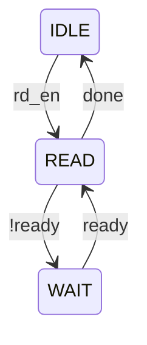
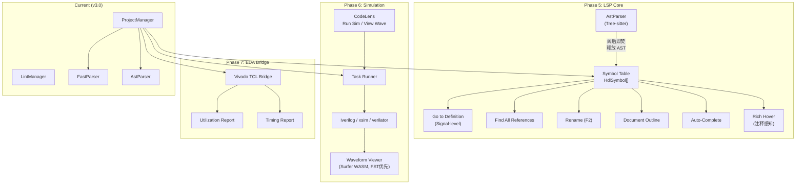

# HDL Helper → HDL Studio IDE 规格说明书

> 目标：从轻量 VS Code 插件演进为 **IC/FPGA 全生命周期的 IDE 级开发工具**，涵盖工程管理、智能编码、仿真驱动、综合联动。

---

## 一、现有能力全景审计

### ✅ 已实现（按成熟度排序）

| 模块 | 功能 | 实现方式 | 成熟度 |
|:-----|:-----|:---------|:------:|
| **多引擎 Linter** | Verible/Vivado/Verilator 并发检查 | [LintManager](file:///e:/Project/Node_Prj/HDL-Helper/src/linter/LintManager.ts#17-142) + Adapter | ⭐⭐⭐⭐⭐ |
| **双引擎解析** | Tree-sitter AST + 正则 FastParser 双层降级 | [AstParser](file:///e:/Project/Node_Prj/HDL-Helper/src/project/astParser.ts#18-287) + [FastParser](file:///e:/Project/Node_Prj/HDL-Helper/src/project/fastParser.ts#8-117) | ⭐⭐⭐⭐ |
| **工程索引** | 扫描 `.f`/全盘文件，构建 moduleMap/fileMap | [ProjectManager](file:///e:/Project/Node_Prj/HDL-Helper/src/project/projectManager.ts#10-174) | ⭐⭐⭐⭐ |
| **层级树视图** | 模块递归套娃、Top Module 选定 | [HdlTreeProvider](file:///e:/Project/Node_Prj/HDL-Helper/src/project/hdlTreeProvider.ts#11-122) | ⭐⭐⭐⭐ |
| **GBK 编码兼容** | 自动检测 GB2312/GBK/UTF-8 | [FileReader](file:///e:/Project/Node_Prj/HDL-Helper/src/utils/fileReader.ts#9-70) | ⭐⭐⭐⭐ |
| **代码生成** | 例化模板、Testbench、信号声明、接口文档 | Commands + Generators | ⭐⭐⭐ |
| **格式化** | Verible Formatter 集成 | [VerilogFormatter](file:///e:/Project/Node_Prj/HDL-Helper/src/formatter.ts#127-136) | ⭐⭐⭐ |
| **Hover 提示** | 模块名悬停显示端口表 | [HoverProvider](file:///e:/Project/Node_Prj/HDL-Helper/src/providers/hoverProvider.ts#6-80) | ⭐⭐⭐ |
| **Jump to Definition** | 模块名跳转（仅限模块级） | [DefinitionProvider](file:///e:/Project/Node_Prj/HDL-Helper/src/providers/defProvider.ts#4-32) | ⭐⭐ |
| **LSP 集成** | Verible Language Server（防火墙过滤诊断） | [languageClient.ts](file:///e:/Project/Node_Prj/HDL-Helper/src/languageClient.ts) | ⭐⭐ |

### ❌ 明显缺失的 IDE 核心能力

| 缺失能力 | 影响 |
|:---------|:-----|
| 信号/变量级 Go to Definition | 无法跳到 wire/reg 的声明位置 |
| Find All References | 无法查找信号在哪些地方被引用 |
| Rename Symbol (F2) | 无法安全批量重命名信号/端口 |
| Symbol Outline | 文件大纲（信号列表/FSM/always 块） |
| Rich Hover（注释感知） | 悬停仅显示类型，不显示声明处的注释说明 |
| Auto-complete (IntelliSense) | 无键入补全 |
| CodeLens（仿真快捷入口） | TB 文件头部无 "Run Simulation" 快捷按钮 |
| 仿真任务编排 | 无法从 IDE 一键 Run Simulation |
| 波形查看 | 无 VCD/FST 波形浏览器 |
| 综合 & 实现联动 | 无 Vivado/Quartus TCL 驱动 |
| 约束文件管理 | 无 .xdc/.sdc 智能编辑 |
| IP 管理 | 无 IP Catalog 浏览/配置 |
| 版本对比 | 无模块接口 diff（端口变更检测）|
| Lint 行内修复 | 无 Quick Fix 代码行动 |
| 多工程/多顶级模块 | 仅支持单 Top Module |

---

## 二、功能路线图

### 🏗️ Phase 5 — 语言服务增强（LSP 核心）

> **目标**：让编辑器像 Vivado 的编辑器一样"懂代码"

#### 5.1 信号级 Go to Definition

**现状**：[defProvider.ts](file:///e:/Project/Node_Prj/HDL-Helper/src/providers/defProvider.ts) 只能跳转到模块名。
**方案**：利用已有的 [AstParser](file:///e:/Project/Node_Prj/HDL-Helper/src/project/astParser.ts#18-287) AST 树，在每个 `module_declaration` 内建立局部**符号表**（Symbol Table）。

```typescript
// 新增数据结构
interface HdlSymbol {
    name: string;              // 信号/变量名
    kind: 'wire'|'reg'|'logic'|'parameter'|'localparam'|'genvar';
    range: vscode.Range;       // 声明位置
    references: vscode.Range[];// 所有引用位置
    type: string;              // 位宽/类型
    fileUri: vscode.Uri;
    comment?: string;          // 声明上方 1-2 行的注释 (用于 Rich Hover)
}
```

**实现路径**：
1. 扩展 `AstParser.parse()` 返回值，增加 `symbols: HdlSymbol[]` 字段
2. 在 AST 的 `net_declaration`, `reg_declaration`, `data_declaration` 节点中提取声明
3. 遍历 AST 所有 `simple_identifier` 引用，匹配到 symbol 表填充 references
4. 在 [defProvider.ts](file:///e:/Project/Node_Prj/HDL-Helper/src/providers/defProvider.ts) 中，当 [getModule()](file:///e:/Project/Node_Prj/HDL-Helper/src/project/projectManager.ts#158-161) 未命中时，回退到 symbol 表查询

**预估工时**：3–5 天

---

#### 5.2 Find All References

**依赖**：5.1 的符号表基础设施。
**方案**：注册 `ReferenceProvider`，直接从 symbol 表读取 `references[]` 数组。

```typescript
// src/providers/referenceProvider.ts
class VerilogReferenceProvider implements vscode.ReferenceProvider {
    provideReferences(doc, position, context, token) {
        // 1. 定位光标所在单词
        // 2. 在 symbol 表中查找匹配
        // 3. 返回所有 reference 的 Location[]
    }
}
```

**预估工时**：1–2 天

---

#### 5.3 Document Symbol / Outline

**目标**：在 VS Code 的 Outline 面板中显示模块内部结构（端口、参数、always 块、generate 块）。
**方案**：注册 `DocumentSymbolProvider`，遍历 AST 按节点类型分层返回。

```
module top_module
  ├── 📌 Parameters: WIDTH, DEPTH
  ├── 🔌 Ports: clk, rst_n, data_in, data_out
  ├── ⚡ always @(posedge clk)  [line 25]
  ├── ⚡ always_comb             [line 42]
  └── 🏗️ generate: gen_loop     [line 58]
```

**预估工时**：2–3 天

---

#### 5.4 Smart Auto-Complete (IntelliSense)

**目标**：切换到真正能用的补全。
**方案**：注册 `CompletionItemProvider`，提供以下补全源：

| 触发条件 | 补全内容 |
|:---------|:---------|
| 输入 `.` 后（端口连接） | 当前作用域内所有信号名 |
| 输入模块名首字母 | 所有已索引模块（带参数/端口摘要） |
| 输入 `#(` 后 | 参数列表补全 |
| Snippet 触发词 | `always`, `case`, `fsm`, `axi` 等模板 |

**预估工时**：3–4 天

---

#### 5.5 Rename Symbol (F2)

**依赖**：5.2 `Find All References` 的符号表。
**目标**：安全地批量重命名 `wire`、`reg`、`port`、`parameter` 等信号。这是大型工程中的顶级刚需。
**方案**：注册 `RenameProvider`，从 symbol 表获取所有引用位置，生成 `WorkspaceEdit` 批量替换。

```typescript
// src/providers/renameProvider.ts
class VerilogRenameProvider implements vscode.RenameProvider {
    provideRenameEdits(doc, position, newName, token) {
        // 1. 在 symbol 表中定位光标所在符号
        // 2. 收集声明 + 所有引用的 Location[]
        // 3. 构建 WorkspaceEdit，批量替换为 newName
    }
    prepareRename(doc, position, token) {
        // 校验光标位置是否在可重命名的标识符上
    }
}
```

**预估工时**：1–2 天（在 5.2 基础上顺水推舟）

---

#### 5.6 Rich Hover（注释感知悬停）

**目标**：用户在几千行外悬停某信号时，不仅看到 `wire [31:0] data`，还能看到声明处的注释。
**方案**：

1. 在 5.1 构建符号表时，额外抓取声明行上方 1–2 行的注释（`// ...` 或 `/* ... */`）
2. 存入 `HdlSymbol.comment` 字段
3. 增强 `hoverProvider.ts`，当悬停命中 symbol 表时，将注释渲染为 Markdown 引用块

**效果示例**：
```
📌 wire [31:0] fifo_rd_data
> FIFO 读出数据，低位有效 (声明于 line 42)
```

**预估工时**：1 天

---

### 🏗️ Phase 6 — 仿真驱动 (Simulation Task Runner)

> **目标**：一键 Run Simulation，IDE 内查看结果

#### 6.1 仿真任务配置 (Task Profiles)

**方案**：在 `.vscode/hdl_tasks.json` 中定义仿真 profile，支持多个仿真器：

```jsonc
{
    "tasks": [
        {
            "name": "RTL Sim",
            "tool": "iverilog",               // 或 "xsim", "modelsim", "verilator"
            "top": "tb_top",
            "sources": ["src/**/*.sv", "tb/**/*.sv"],
            "flags": ["-g2012"],
            "waveform": true,                  // 自动生成波形
            "waveformFormat": "fst"             // vcd | fst
        }
    ]
}
```

**UI 集成**：
- 在树形视图增加 **"Simulation Tasks"** 面板
- 右键 Testbench 模块 → `Run Simulation`
- Terminal 面板实时输出仿真日志
- **CodeLens 沉浸式入口**：AST 识别到 TB 模块（`tb_` 前缀或无外部端口）时，在 `module` 声明行上方自动显示：
  `▶️ Run Simulation` | `📊 View Waveform`

```typescript
// src/providers/simCodeLensProvider.ts
class SimCodeLensProvider implements vscode.CodeLensProvider {
    provideCodeLenses(doc, token) {
        // 1. AST 解析当前文件的 module 声明
        // 2. 判断是否为 Testbench (tb_ 前缀 || 无端口)
        // 3. 在 module 行返回 CodeLens: "Run Simulation" / "View Waveform"
    }
}
```

**预估工时**：5–7 天（含 CodeLens）

---

#### 6.2 波形查看器集成

> [!IMPORTANT]
> **强制规范：FST 优先**。VCD 是纯文本格式，大型仿真动辄几 GB，WebView 根本吃不消。
> 默认输出格式统一采用 **FST (Fast Signal Trace)**。iverilog (`-fst`) / Verilator 均原生支持。
> 配合 Surfer WASM，加载 GB 级波形仅需几百毫秒。

**方案**：集成 [Surfer](https://surfer-project.org/) 的 WASM 版本嵌入 VS Code WebView。

**最简 MVP**：
1. 仿真完成 → 自动检测 `.fst` / `.vcd` 文件（优先 `.fst`）
2. 点击打开 → 在 VS Code WebView 中显示时序图
3. 支持信号名搜索、缩放、光标对齐
4. VCD 兼容：若仅产出 `.vcd`，提示用户或自动转换为 FST

**预估工时**：7–10 天

---

### 🏗️ Phase 7 — 综合/实现联动 (EDA Tool Integration)

> **目标**：在 VS Code 中无缝调用外部 EDA 工具链

#### 7.1 Vivado TCL Bridge

```typescript
// src/eda/vivadoBridge.ts
class VivadoBridge {
    // 启动 Vivado in batch mode
    runSynth(projectFile: string, topModule: string): Promise<SynthResult>;
    runImpl(projectFile: string): Promise<ImplResult>;
    
    // 解析 Vivado 报告
    parseUtilization(rptPath: string): UtilizationReport;
    parseTiming(rptPath: string): TimingReport;
}
```

**功能点**：

| 功能 | 实现方式 |
|:-----|:---------|
| 一键综合 | `vivado -mode batch -source synth.tcl` |
| 资源利用率面板 | 解析 `utilization.rpt`，WebView 可视化 LUT/FF/BRAM 占用 |
| 时序报告面板 | 解析 `timing_summary.rpt`，高亮违规路径 |
| Bitstream 生成 | 自动调用 `write_bitstream` |

**预估工时**：7–10 天

---

#### 7.2 约束文件智能编辑 (.xdc / .sdc)

- 语法高亮（TextMate grammar for XDC）
- 引脚自动补全（基于 FPGA 型号的引脚数据库）
- IO Standard 校验

**预估工时**：5–7 天

---

### 🏗️ Phase 8 — 工程管理增强

#### 8.1 多工程支持

**现状**：全局一个 `ProjectManager`，一个 `topModuleName`。
**方案**：引入 `Workspace` 概念，每个 Workspace 持有独立的 moduleMap、fileMap、Top Module。

```typescript
class HdlWorkspace {
    name: string;
    rootUri: vscode.Uri;
    projectManager: ProjectManager;
    topModule: string | null;
    simProfiles: SimTask[];
}
```

---

#### 8.2 模块接口变更检测

**场景**：子模块端口变了，上层例化代码没同步更新，综合才发现。
**方案**：

1. `ProjectManager` 在 `updateFile` 时，对比新旧 `HdlModule.ports`
2. 若检测到端口新增/删除/改名，生成 `DiagnosticSeverity.Warning`
3. 提供 Quick Fix：自动更新所有例化处的端口列表

**预估工时**：3–5 天

---

#### 8.3 IP Catalog 浏览器

在侧边栏增加 **IP Explorer** 面板：
- 扫描 `.xci` / `.ip` 文件
- 显示 IP 名称、版本、参数配置
- 右键 → 在 Vivado 中打开 IP Customizer

---

### 🏗️ Phase 9 — 代码质量与重构

#### 9.1 Lint Quick Fix (Code Actions)

**目标**：不仅报错，还帮你一键修。
**方案**：注册 `CodeActionProvider`，为常见 Lint Warning 提供修复：

| Warning | Quick Fix |
|:--------|:----------|
| `ALWAYS_COMB` | 将 `always @(*)` 替换为 `always_comb` |
| `NO_TRAILING_SPACES` | 一键清理尾部空格 |
| `LINE_LENGTH` | 自动断行格式化 |
| `WIDTH` (Verilator) | 在赋值处补加位宽截断 `[N-1:0]` |

**预估工时**：3–5 天

---

#### 9.2 FSM 可视化

**目标**：选中一个 `always` 块 → 自动生成状态机图。
**方案**：

1. 用 AST 解析 `case` 语句中的状态跳转关系
2. 生成 Mermaid `stateDiagram-v2` 文本
3. 在 VS Code WebView 中渲染



**预估工时**：5–7 天

---

### 🏗️ Phase 10 — 高级代码生成

#### 10.1 AXI 接口向导

注册命令 `HDL: Generate AXI Interface`，弹出多步 WebView 表单：
1. 选择 AXI 协议类型（AXI4-Full / AXI4-Lite / AXI4-Stream）
2. 配置数据宽度、地址宽度、寄存器数量
3. 一键生成 Master/Slave RTL + 验证 TB

#### 10.2 FIFO / RAM 生成器

内置常用 IP 的行为级模板：
- Sync FIFO / Async FIFO
- Single-Port / Dual-Port RAM
- 参数化深度和宽度

#### 10.3 寄存器表驱动代码生成

**输入**：Excel / CSV / JSON 格式的寄存器定义表
**输出**：
- RTL 寄存器读写逻辑（AXI-Lite Slave）
- C Header（寄存器地址偏移宏定义）
- Markdown 文档

---

## 三、优先级矩阵

```
影响力 ↑
  │
  │  [P1] 信号级跳转    [P1] Outline      [P1] Rename (F2)
  │  [P1] AutoComplete   [P1] Quick Fix   [P1] Rich Hover
  │
  │  [P2] 仿真 Runner    [P2] FSM 可视化   [P2] CodeLens
  │  [P2] 波形查看器      [P2] AXI 向导
  │
  │  [P3] Vivado Bridge  [P3] IP Catalog
  │  [P3] .xdc 编辑器    [P3] 多工程
  │
  │  [P4] 寄存器表       [P4] 接口 Diff
  │
  └──────────────────────────────→ 实现难度
```

| 优先级 | Phase | 功能集 | 预估总工时 |
|:------:|:-----:|:-------|:----------:|
| **P1** | 5 | LSP 增强（信号跳转、Outline、补全、Rename、Rich Hover、Quick Fix）| 15–22 天 |
| **P2** | 6 + 9.2 | 仿真驱动 + CodeLens + FSM 可视化 | 17–24 天 |
| **P3** | 7 + 8 | EDA 联动 + 工程管理增强 | 15–22 天 |
| **P4** | 10 | 高级代码生成 | 10–15 天 |

---

## 四、技术架构演进图



---

## 五、关键设计约束

| 约束 | 应对策略 |
|:-----|:---------|
| **⚠️ Tree-sitter AST 内存陷阱** | **"阅后即焚"策略**：AST 解析后立刻提取轻量级 `HdlSymbol[]` / `HdlModule` 存入缓存，**立刻销毁原生 AST 对象**（SyntaxNode 含 parent/child/sibling 强引用链）。仅在用户当前编辑的文件保留一棵活动 AST |
| VS Code 扩展不能直接访问 GPU | WebView + Canvas 2D 渲染波形 |
| Node.js / WASM 内存上限 ≈ 2–4 GB | 增量解析（文件改动时只重新解析该文件） |
| VCD 格式不可接受 | 强制 FST 优先（二进制压缩，GB 级秒加载） |
| Verilator 无法正式安装的用户 | `activeEngines` 配置灵活选择，不强依赖 |
| Vivado 许可证限制 | TCL Bridge 仅调用命令行，不嵌入 GUI |
| 国内网络环境 | 所有外部依赖直接打包或提供镜像配置 |

---

## 六、版本号规划

| 版本 | 里程碑 | 状态 |
|:----:|:-------|:----:|
| v2.3.5 | 基础 Lint + 代码生成 + LSP | ✅ 已发布 |
| **v3.0** | **Tree-sitter AST + 多引擎 Linter + GBK** | **✅ 当前** |
| v3.1 | 信号级跳转 + Outline + AutoComplete + Rich Hover | 🔜 |
| v3.2 | Rename (F2) + Quick Fix + FSM 可视化 | 📋 |
| v4.0 | 仿真驱动 + CodeLens + 波形 (FST) | 📋 |
| v5.0 | Vivado Bridge + IP Catalog | 📋 |
